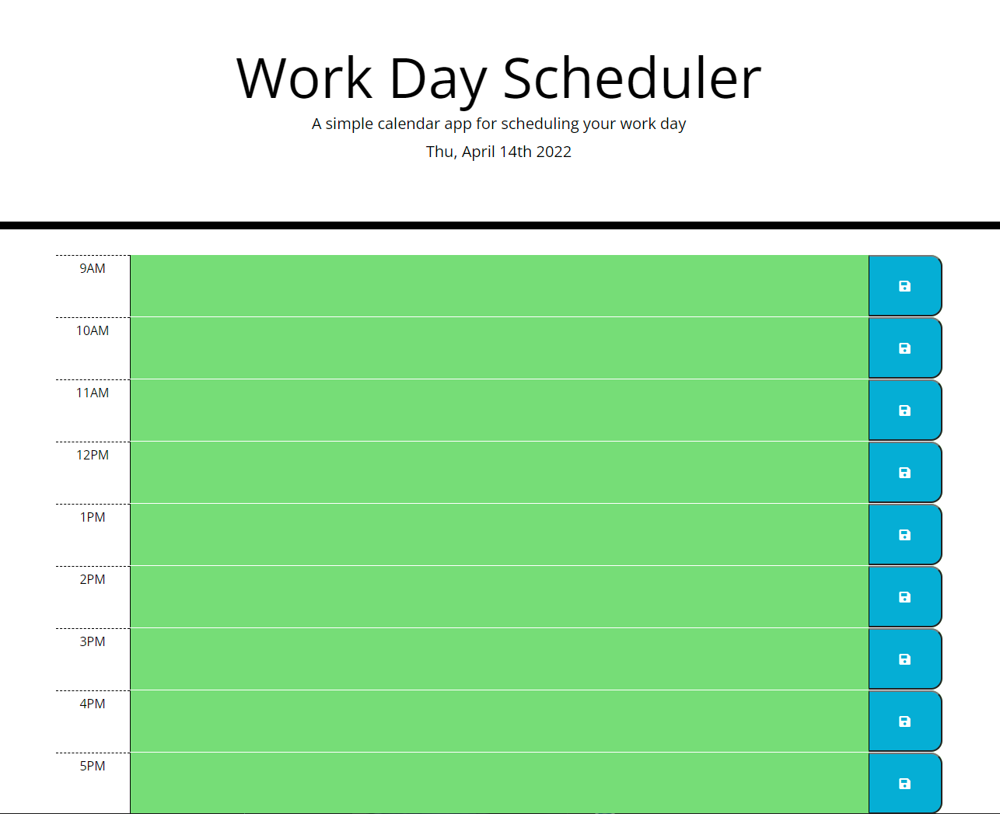

# my-scheduler-3pAPI
This is a simple calendar application that allows users to keeping tracks of their tasks daily and hourly. 

## Website Links/URL
Deployed: https://binnie51.github.io/my-scheduler-3pAPI/

## How does this function?
As soon as users launch the app, they will be greeted by the current date and time at the top of the page. The timeblocks represents a regular business hours of 9AM to 5PM. Each timeblock will change color based on the current live time: grey represents the past, coral red represents the present, and pastel green respresents the future.
Users able to type in entries when they clicked on the timeblocks and customized their daily itenerary however they are pleased.  

## Demo

Note: the timeblocks on the video may seem to appear grey due to the time the video was made. The blocks should reset to green, indicating future time during midnight.

## Screenshots

